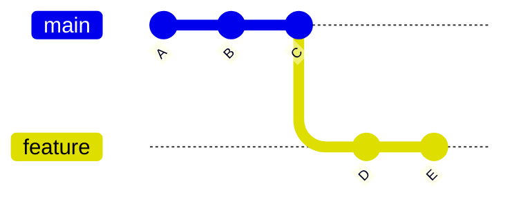
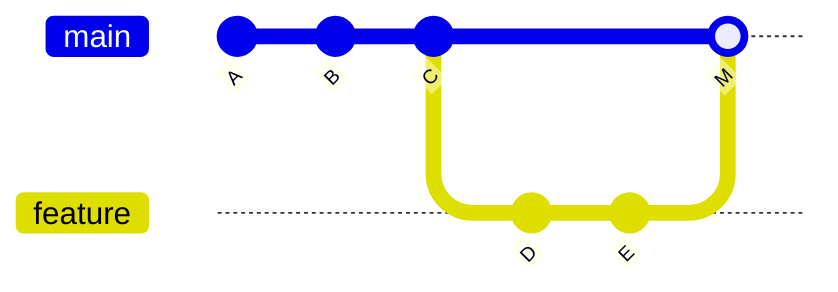
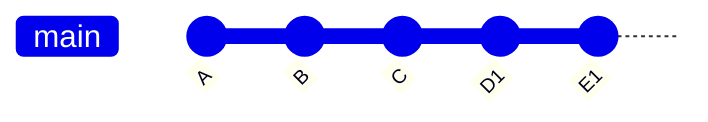
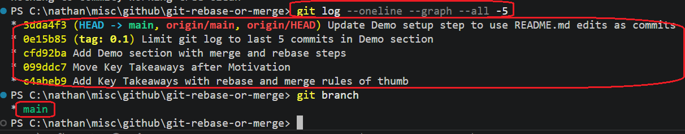
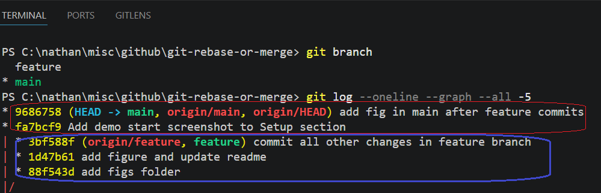
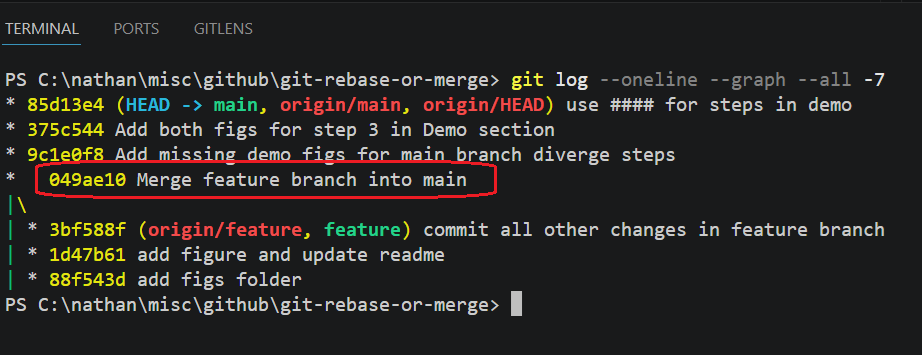
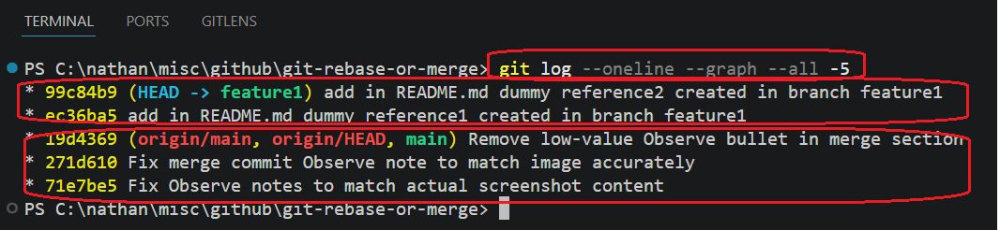
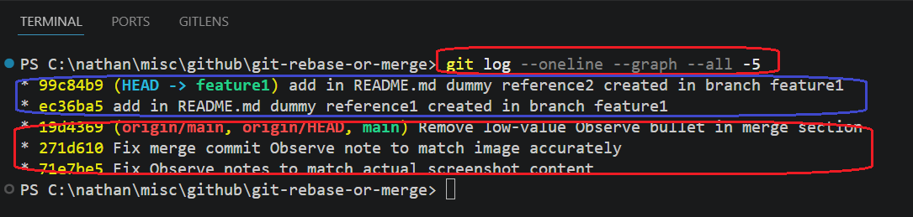
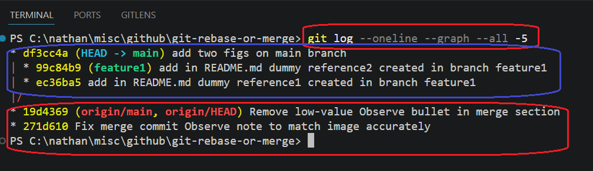
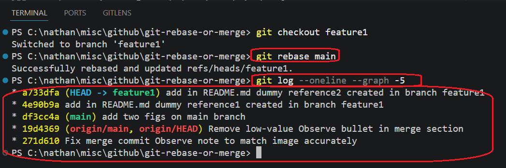

# Project Name

Merge vs Rebase by Example

## Project Description

A visual, command-based learning project for understanding `git merge` and `git rebase` through commit graphs, real repository history, and direct experimentation.

The project explains how commits, branches, and history rewriting work internally — helping developers build an intuitive mental model of Git instead of memorizing commands.

## Motivation

Git tutorials and AI tools often recommend both `git merge` and `git rebase`, but the difference between them can feel unclear.

This project explores:
- what each command actually does
- how commits and branches behave
- why rebase rewrites history
- how Git history forms a graph

using direct command-based experimentation and visualization.

## Key Takeaways
- Rule of thumb: local/feature branch → rebase; shared/public branch → merge.
- Rebase branches you fully control; merge branches others depend on.
- Rebase is often used before merge — clean up your branch first, then merge into the target branch (never rebase a branch others are actively using).

## Core Concepts: git merge vs git rebase

> Notation: each letter (A, B, C…) represents a commit; `---` is the chain over time (left = oldest, right = newest).

### git merge (preserves history)

Combines branches with a merge commit. Does not rewrite commits.

> `feature` branch merges into `main`

**Before merge:**



**After merge** (history stays branched):



> `M` = merge commit (auto-created by git to join the two branches)

Use when: working on shared/public branches — merge preserves the full history so others can see exactly what happened and when.

### git rebase (rewrites history)

Replays commits on top of another branch. Creates new commit hashes.

> `feature` branch rebases onto `main`

**Before rebase:**


**After rebase** (history becomes linear — D1 and E1 have the same changes as D and E but with new hashes):



Use when: cleaning up local branches or before opening a PR — rebase makes history linear so reviewers see a clean, easy-to-follow commit sequence.

### How commits behave

- merge → commits are preserved
- rebase → commits are rewritten (new hashes)


## Decision Guide

| Goal                  | Command  | Why                                     |
|-----------------------|----------|-----------------------------------------|
| Update my branch      | rebase   | Keeps history linear, no merge commit   |
| Combine branches      | merge    | Preserves full history of both branches |
| Prepare clean PR      | rebase   | Cleaner diff for reviewers              |
| Finalize feature      | merge    | Creates explicit record of the merge    |


## Usage

```bash
git log --oneline --graph --all -5  # visualize branch history
git merge feature                   # merge feature into main (run from main)
git rebase main                     # rebase feature onto main (run from feature)
git log --oneline --graph -7        # inspect merge result
git log --oneline --graph -5        # inspect rebase result
```


## Demo

### Setup

#### 1. Create `main` branch with a few commits and run `git log --oneline --graph --all -5` to visualize



Observe:
- `git branch` confirms only `main` exists
- all commits (`*`) are in a single linear chain — no branching
- `HEAD -> main` points to the latest commit

#### 2. Branch off to `feature`, add 2 commits, then add 1 more commit to `main` so branches diverge

#### 3. Run `git log --oneline --graph --all -5` to visualize diverged state



Observe:
- `git branch` shows both `main` and `feature` now exist
- `main` commits (red, top) and `feature` commits (blue, bottom) diverge from a common ancestor
- the `/` at the bottom marks where the two branches split

### git merge

#### 4. `git checkout main && git merge feature`
#### 5. Run `git log --oneline --graph -7` to see merge commit M
> `--all` omitted — shows only main's result after merge, not all branches.



Observe:
- the highlighted commit (`049ae10`) is the merge commit
- feature branch commits appear below it as a separate line joining in
- both branches' commits are preserved with their original hashes

### git rebase

#### 6. Create `feature1` branch from `main` and add 2 commits
#### 7. Run `git log --oneline --graph --all -5`



Observe:
- `feature1` (HEAD) has 2 new commits on top of `main`'s latest (`19d4369`)
- no divergence yet — `feature1` is simply ahead



Observe:
- `feature1` commits (blue) and `main` commits (red) clearly distinct
- still a single linear chain — no fork

#### 8. Add 1 commit to `main`, run `git log --oneline --graph --all -5`



Observe:
- `main` (`df3cc4a`, HEAD) and `feature1` (`99c84b9`) now diverge from common ancestor `19d4369`
- `|` next to feature1's commits marks the two branches running in parallel
- `|/` at the bottom marks where both branches connect back to the common ancestor

#### 9. `git checkout feature1 && git rebase main`
#### 10. Run `git log --oneline --graph -5`
> `--all` omitted — shows only feature1's linear history after rebase.



Observe:
- feature1's commits were rewritten: `99c84b9` → `a733dfa`, `ec36ba5` → `4e90b9a` — same changes, new hashes
- history is now a straight line — no fork, no merge commit
- `main`'s new commit (`df3cc4a`) now appears before feature1's commits


## References
- [git-merge documentation](https://git-scm.com/docs/git-merge)
- [git-rebase documentation](https://git-scm.com/docs/git-rebase)
- [Understanding Git Commits: A Practical Guide](https://youtu.be/6tflUkytj9Q)
