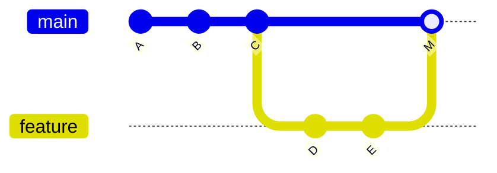
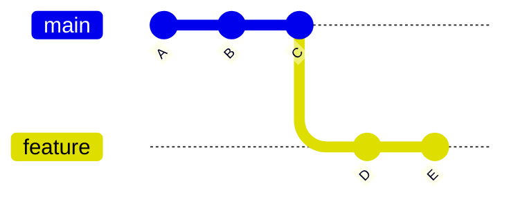

# Project Name

...

## Project Description

...

## Motivation

in many ocations you ask AI question and sometime it use git merge and somtime git rebase so question is
- what exactly each does 
- when to use each ?
- how commit playes in
- can we see it grphically

## Core Concepts: git merge vs git rebase

> Notation: each letter (A, B, C…) represents a commit; `---` is the chain over time (left = oldest, right = newest).

### git merge (preserves history)

Combines branches with a merge commit. Does not rewrite commits.



> `M` = merge commit (auto-created by git to join the two branches)

Use when: working on shared/public branches, or you want accurate history.

### git rebase (rewrites history)

Replays commits on top of another branch. Creates new commit hashes.

**Before rebase:**



**After rebase** (feature replayed on top of main):


Use when: cleaning up local branches, or before opening a PR.

### How commits behave

- merge → commits are preserved
- rebase → commits are rewritten (new hashes)

### Visualizing history

```bash
git log --oneline --graph --all
```

## Decision Guide

| Goal                  | Command  | Why                                     |
|-----------------------|----------|-----------------------------------------|
| Update my branch      | rebase   | Keeps history linear, no merge commit   |
| Combine branches      | merge    | Preserves full history of both branches |
| Prepare clean PR      | rebase   | Cleaner diff for reviewers              |
| Finalize feature      | merge    | Creates explicit record of the merge    |

## Key Takeaways
- [Item 1]
- [Item 2]

## Installation

...

## Usage

...

## Technologies Used

- git

## Code Structure

...

## Demo

...

## Points of Interest
- [Item 1]
- [Item 2]

## References
- [Link/Reference 1]
- [Link/Reference 2]
