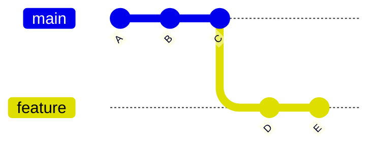
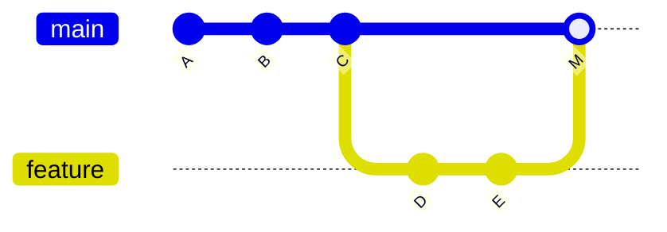
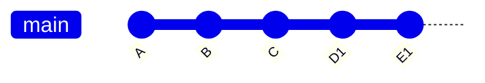
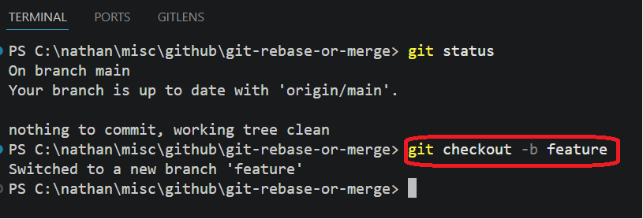
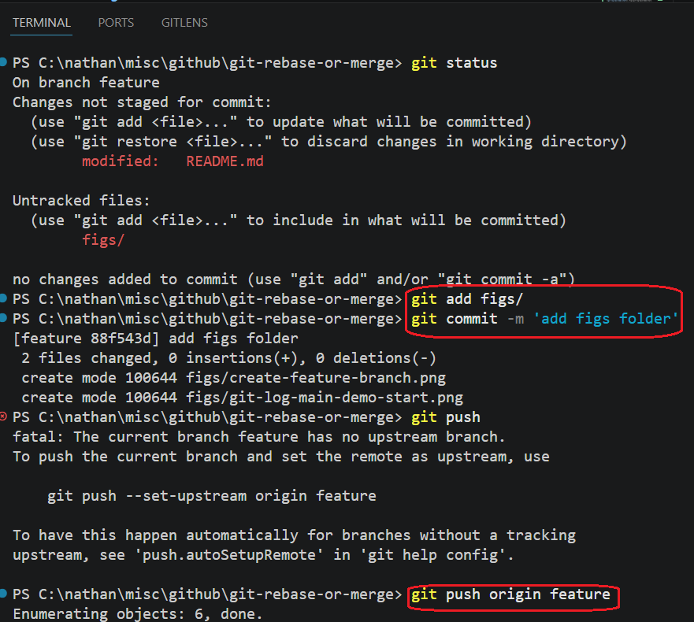
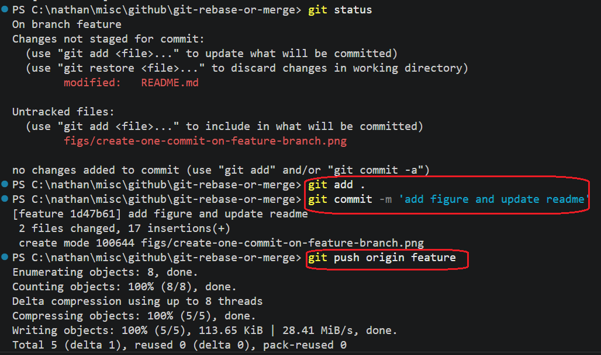
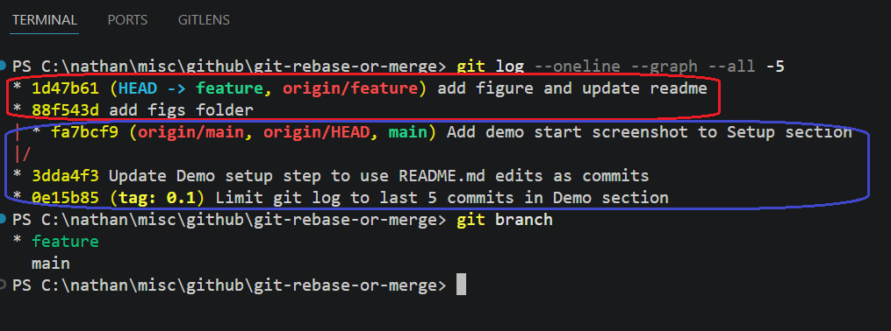
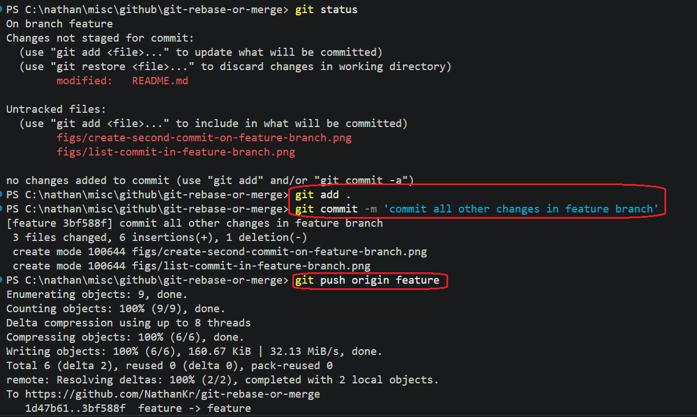
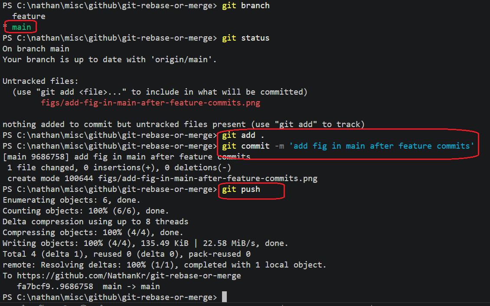
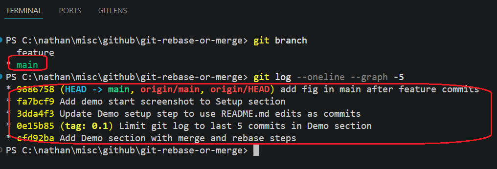

# Project Name

...

## Project Description

A visual, command-based learning project for understanding `git merge` and `git rebase` through commit graphs, real repository history, and direct experimentation.

The project explains how commits, branches, and history rewriting work internally — helping developers build an intuitive mental model of Git instead of memorizing commands.

## Motivation

When asking AI tools or reading Git tutorials, developers often see both `git merge` and `git rebase` recommended in different situations.

This raises important questions:

- What exactly does each command do?
- Why does `rebase` rewrite history while `merge` preserves it?
- How do commits and branches behave internally?
- What does Git history actually look like?
- Can we visualize these operations instead of memorizing them?

The confusion usually comes from treating Git as a set of commands instead of understanding the underlying commit graph model.

This project explores `merge` and `rebase` through direct experimentation, commit visualization, and real Git history so the behavior becomes intuitive rather than magical.

## Key Takeaways
- Rule of thumb: local/feature branch → rebase; shared/public branch → merge.
- Rebase branches you fully control; merge branches others depend on.
- Rebase is often used before merge — clean up your branch first, then merge into the target branch (never rebase a branch others are actively using).

## Core Concepts: git merge vs git rebase

> Notation: each letter (A, B, C…) represents a commit; `---` is the chain over time (left = oldest, right = newest).

### git merge (preserves history)

Combines branches with a merge commit. Does not rewrite commits.

> `feature` branch merges into `main`

**Before merge:**



**After merge** (history stays branched):



> `M` = merge commit (auto-created by git to join the two branches)

Use when: working on shared/public branches — merge preserves the full history so others can see exactly what happened and when.

### git rebase (rewrites history)

Replays commits on top of another branch. Creates new commit hashes.

> `feature` branch rebases onto `main`

**Before rebase:**


**After rebase** (history becomes linear — D1 and E1 have the same changes as D and E but with new hashes):



Use when: cleaning up local branches or before opening a PR — rebase makes history linear so reviewers see a clean, easy-to-follow commit sequence.

### How commits behave

- merge → commits are preserved
- rebase → commits are rewritten (new hashes)

### Visualizing history

```bash
git log --oneline --graph --all
```

## Decision Guide

| Goal                  | Command  | Why                                     |
|-----------------------|----------|-----------------------------------------|
| Update my branch      | rebase   | Keeps history linear, no merge commit   |
| Combine branches      | merge    | Preserves full history of both branches |
| Prepare clean PR      | rebase   | Cleaner diff for reviewers              |
| Finalize feature      | merge    | Creates explicit record of the merge    |


## Usage

```bash
git log --oneline --graph --all -5  # visualize branch history
git merge feature                   # merge feature into main (run from main)
git rebase main                     # rebase feature onto main (run from feature)
git log --oneline --graph -7        # inspect merge result
git log --oneline --graph -5        # inspect rebase result
```


## Demo

### Setup

#### 1. Create `main` branch with few commits (e.g. edit README.md) and Run `git log --oneline --graph --all -5` to visualize 


#### 2. Branch off to `feature` and add 2 commits




add first commit on feature branch



add second commit on feature branch



Run `git log --oneline --graph --all -5` to visualize 
We can see the two new commits in feature branch (in red) on top of the commits of main branch (in blue)



commit all changes


#### 3. Add 1 more commit to `main` so branches diverge



#### 4. Run `git log --oneline --graph --all -5` to visualize before state


now we can see only main commits



### git merge

#### 5. `git checkout main && git merge feature`
#### 6. Run `git log --oneline --graph -7` to see merge commit M
> `--all` omitted — shows only main's result after merge, not all branches.

The merge commit is in red


<!-- add image here -->

### git rebase

#### 7. Reset to before-merge state
#### 8. `git checkout feature && git rebase main`
#### 9. Run `git log --oneline --graph -5` to see linear history
> `--all` omitted — shows only feature's linear history after rebase.

<!-- add image here -->


## References
- [git-merge documentation](https://git-scm.com/docs/git-merge)
- [git-rebase documentation](https://git-scm.com/docs/git-rebase)
- [Understanding Git Commits: A Practical Guide](https://youtu.be/6tflUkytj9Q)
