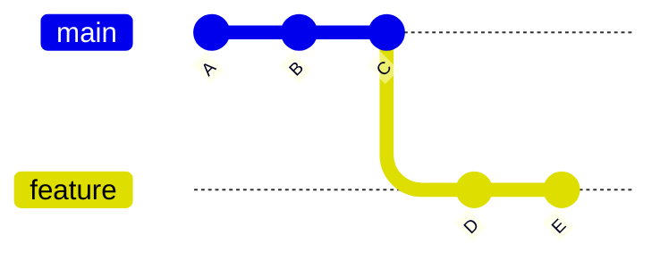
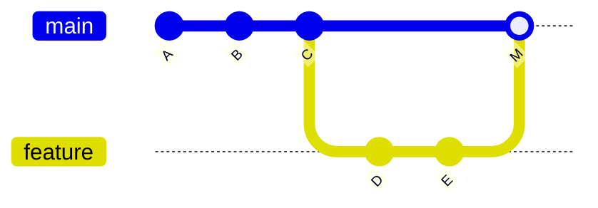
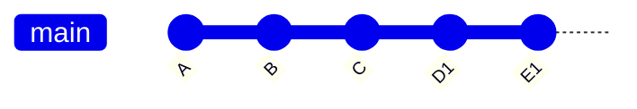

# Project Name

...

## Project Description

...

## Motivation

in many ocations you ask AI question and sometime it use git merge and somtime git rebase so question is
- what exactly each does 
- when to use each ?
- how commit playes in
- can we see it grphically

## Key Takeaways
- Rule of thumb: local/feature branch → rebase; shared/public branch → merge.
- Rebase branches you fully control; merge branches others depend on.
- Rebase is often used before merge — clean up your branch first, then merge into the target branch (never rebase a branch others are actively using).

## Core Concepts: git merge vs git rebase

> Notation: each letter (A, B, C…) represents a commit; `---` is the chain over time (left = oldest, right = newest).

### git merge (preserves history)

Combines branches with a merge commit. Does not rewrite commits.

> `feature` branch merges into `main`

**Before merge:**



**After merge** (history stays branched):



> `M` = merge commit (auto-created by git to join the two branches)

Use when: working on shared/public branches — merge preserves the full history so others can see exactly what happened and when.

### git rebase (rewrites history)

Replays commits on top of another branch. Creates new commit hashes.

> `feature` branch rebases onto `main`

**Before rebase:**


**After rebase** (history becomes linear — D1 and E1 have the same changes as D and E but with new hashes):



Use when: cleaning up local branches or before opening a PR — rebase makes history linear so reviewers see a clean, easy-to-follow commit sequence.

### How commits behave

- merge → commits are preserved
- rebase → commits are rewritten (new hashes)

### Visualizing history

```bash
git log --oneline --graph --all
```

## Decision Guide

| Goal                  | Command  | Why                                     |
|-----------------------|----------|-----------------------------------------|
| Update my branch      | rebase   | Keeps history linear, no merge commit   |
| Combine branches      | merge    | Preserves full history of both branches |
| Prepare clean PR      | rebase   | Cleaner diff for reviewers              |
| Finalize feature      | merge    | Creates explicit record of the merge    |

## Installation

...

## Usage

...

## Technologies Used

- git

## Code Structure

...

## Demo

...

## Points of Interest
- [Item 1]
- [Item 2]

## References
- [Link/Reference 1]
- [Link/Reference 2]
